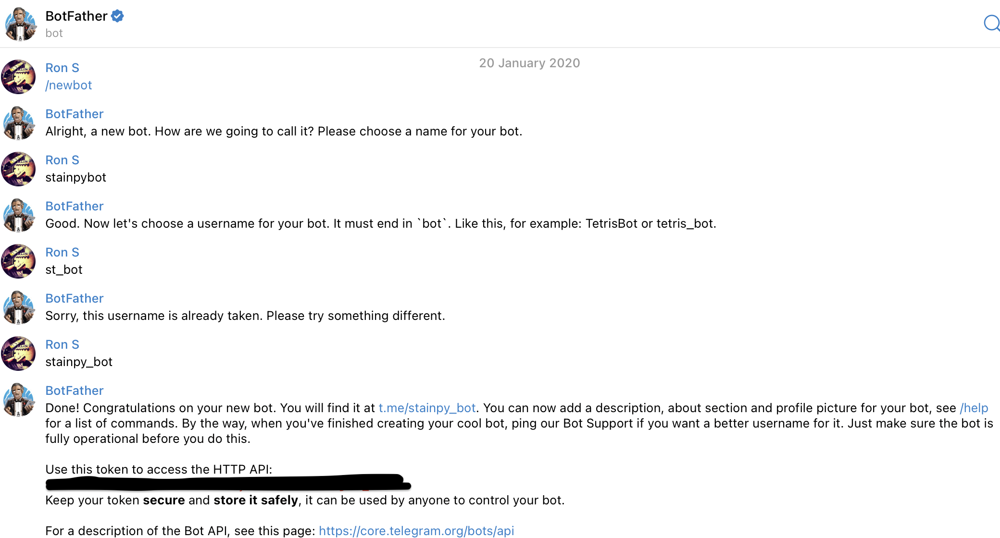

# Project name: Telegram Weather Bot (Python 3.9)

### This custom weather bot is implemented using public APIs - telebot and open weather map. 
#### This instruction contains steps of how to configure and run the program locally

#### How to set up and use:

0. Install python 3.9 and requirements.txt. Program will not work on Python 10...
1. You will need to generate your private key from Open Weather Map and place it either in 
txt file like "private_owm_key.txt" or directly in code in open_weather_map.py on line
16:

```python
def weather_request():
    my_key = "<your_key>"
    ...
```
or 
```python
def weather_request():
    my_key = getPrivateKey('private_owm_key.txt')
```

2. You will need to generate you private Telegram key and place it either in 
txt file like "private_telegram_key.txt" or directly in code in custom_weather_bot.py on line
6: 

```python

bot = telebot.TeleBot(getPrivateKey('private_telegram_key.txt'), parse_mode=None)

```

or 

```python

bot = telebot.TeleBot(getPrivateKey('<your_private_key>'), parse_mode=None)
```

How to get your bot telegram key:



3. After all is done you can navigate to custom_weather_bot.py at line 73 and
run program.


NOTE: 
In current implementation each weather request is done within 3 steps.
In future implementations this is planned to be fixed to 1 step.

### Thanks and good luck.